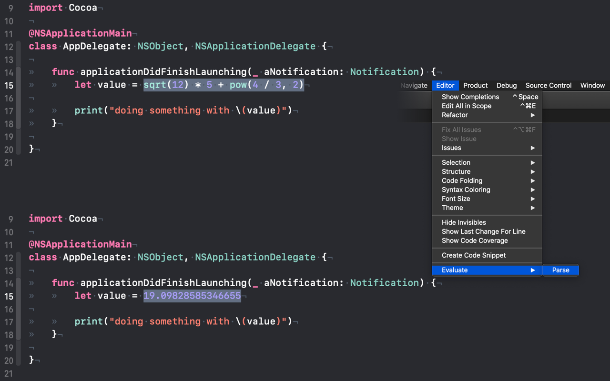

#  Evaluate for Xcode

A simple extension for Xcode that allows you to evaluate mathematical expressions.

# Acknowledgment

This was inspired by a similar extension for Sublime Text 2: https://github.com/jbrooksuk/Sublime-Evaluate.
